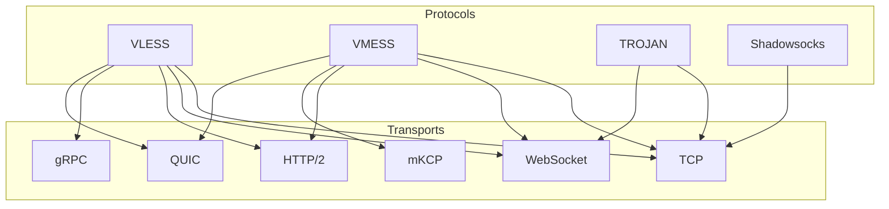

# 05 — V2Ray protocol family overview

V2Ray (Project V) defines **inbound/outbound protocols** (how a client proves who
it is and where it wants to go) layered over **transports** (how bytes move:
TCP, WebSocket, H2, gRPC, mKCP, QUIC). proxy-suite implements two combinations:
**VLESS+WS** and **Trojan+WS**.

## Comparison

| Protocol | Identity | Encryption | UDP | Multiplex | Fingerprint resistance | Status here |
|----------|----------|------------|-----|-----------|------------------------|-------------|
| [VLESS](./06-vless.md) | UUID (lightweight) | none (rely on TLS) | spec yes, **rejected** | via XTLS/Vision (not here) | good with TLS+WS+CDN | ✅ implemented |
| [Trojan](./07-trojan.md) | password → SHA224 | TLS (imitates HTTPS) | no | no | excellent (looks like HTTPS) | ✅ implemented |
| [VMess](./08-vmess.md) | UUID + time-based AEAD | AES-128-GCM / ChaCha20 | yes | yes (mKCP etc.) | good, heavier | 📖 reference only |
| [Shadowsocks](./09-shadowsocks.md) | pre-shared key | AEAD ciphers | yes (UDP relay) | no | moderate | 📖 reference only |
| SOCKS5 / HTTP | user/pass (optional) | none | SOCKS yes | no | poor (plaintext) | not in scope |
| Dokodemo-door | none (transparent) | none | yes | n/a | n/a (inbound helper) | not in scope |
| Freedom / Blackhole | n/a (outbounds) | n/a | — | — | — | not in scope |

## How to choose

- **VLESS+WS+TLS+CDN:** cheapest to scale behind a CDN, minimal crypto overhead.
  Pick when you control the edge and want many clients per domain.
- **Trojan+TLS:** hardest to fingerprint passively (valid TLS + HTTPS-like
  fallback). Pick when stealth matters more than raw throughput.
- **VMess:** legacy; keep for old clients, prefer VLESS for new deployments.
- **Shadowsocks:** simplest for single-hop personal use; weaker against active probing.

## Transports

See [10-transports](./10-transports.md). This repo pins `type=ws`, `security=none`
internally; set `security=tls` on the **client** when a reverse proxy adds TLS.

