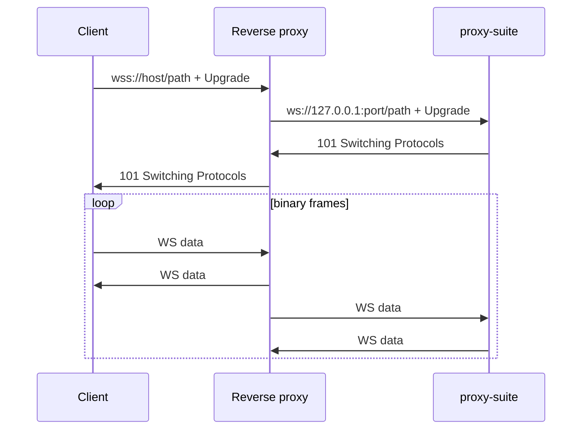

# 10 — Transports

Protocols (VLESS/Trojan/VMess) ride on **transports**. This repo implements one:
plain **WebSocket**. Clients add TLS at the edge.

## WebSocket (implemented)

- Client: `GET <websocket.path> HTTP/1.1` + `Upgrade: websocket`.
- Server: exact pathname match → `wss.handleUpgrade`; else **destroy socket**
  (no HTTP response — see `rawUpgradeHead` in `tests/helpers.ts`).
- Frames: first **binary** frame = handshake; text frames ignored.
- Limits: `maxPayload 16 MB`; VLESS header cap `4096 B`.
- Plain `ws://` in-process; terminate TLS upstream for `wss://`.



Nginx snippet (example):

```nginx
location /vless-ws {
    proxy_pass http://127.0.0.1:8080;
    proxy_http_version 1.1;
    proxy_set_header Upgrade $http_upgrade;
    proxy_set_header Connection "upgrade";
    proxy_set_header Host $host;
}
```

## Other V2Ray transports (reference)

| Transport | How it looks | Best for | Notes |
|-----------|--------------|----------|-------|
| TCP (raw) | bare protocol bytes | internal hops | trivially fingerprinted on Internet |
| H2 | HTTP/2 streams | multiplexed WS alternative | needs ALPN + TLS |
| gRPC | unary/stream RPCs | CDN-friendly, modern | `GunService/Tun` framing |
| mKCP | UDP with FEC | lossy links | noisy, poor stealth |
| QUIC | UDP+TLS 1.3 | low latency | UDP often throttled |

Client `type=` values: `tcp | ws | h2 | grpc | kcp | quic`. This repo only emits
`type=ws`.
