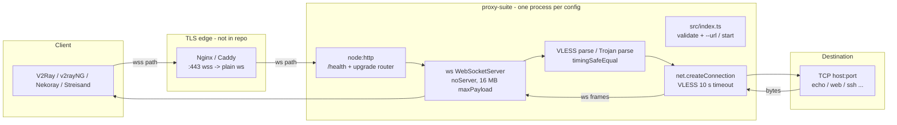
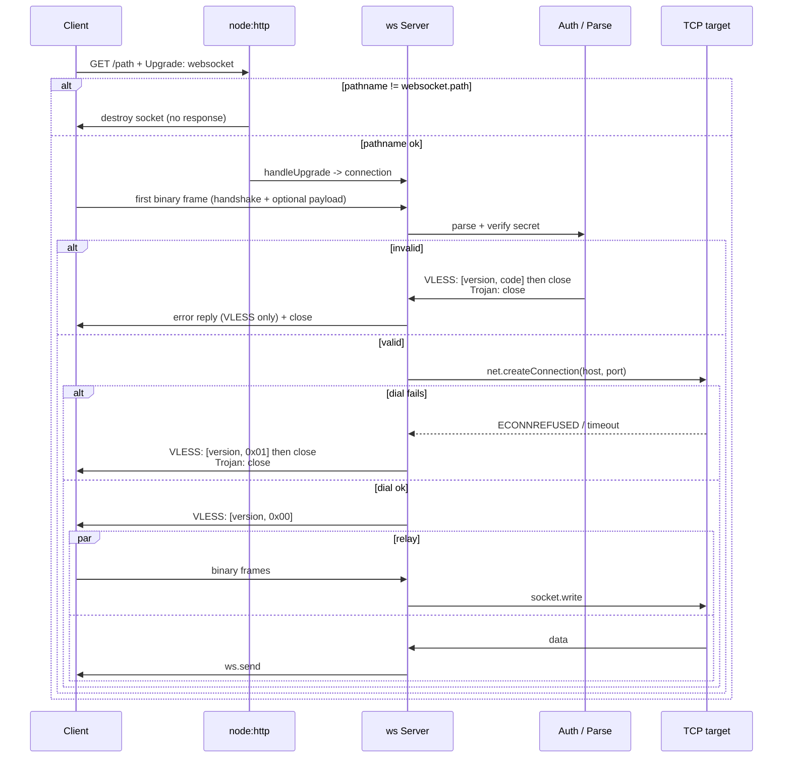

# 04 — البنية المعمارية

## المكونات



## دورة حياة الطلب (مشتركة)



## تدفق VLESS-WS (تفصيلي)

```mermaid
sequenceDiagram
    participant C as Client
    participant S as VLESS-WS V2
    participant T as TCP
    C->>S: WS open /vless-ws
    C->>S: [ver|uuid16|addonsLen|addons|cmd|port|atyp|addr|payload]
    Note over S: buffer until complete;<br/>cap 4096 B; timingSafeEqual UUID
    alt UUID bad
        S->>C: [ver, 0x03] + close
    else cmd != 0x01
        S->>C: [ver, 0x02] + close
    else ok
        S->>T: connect(host, port) 10 s timeout
        alt fail
            S->>C: [ver, 0x01] + close
        else ok
            S->>C: [ver, 0x00]
            S->>T: write(initial payload if any)
            loop relay
                C->>S: ws frame
                S->>T: write
                T->>S: data
                S->>C: ws.send
            end
        end
    end
```

## تدفق Trojan-WS (تفصيلي)

```mermaid
sequenceDiagram
    participant C as Client
    participant S as Trojan-WS
    participant T as TCP
    C->>S: WS open /trojan-ws
    C->>S: [SHA224(pass) 56B|CRLF|0x01|atyp|addr|port|CRLF|payload]
    Note over S: timingSafeEqual(hash);<br/>CMD must be 0x01
    alt hash / CRLF / SOCKS bad
        S->>C: close (no reply)
    else ok
        S->>T: connect(host, port)
        alt fail
            S->>C: close
        else ok
            S->>T: write(initial payload if any)
            loop relay
                C->>S: ws frame
                S->>T: write
                T->>S: data
                S->>C: ws.send
            end
        end
    end
```

## الإغلاق والتنظيف

دوال `start*` تُرجع `{ httpServer, wss, close }`. وتقوم `close()` بما يلي:

1. `ws.terminate()` لكل عميل متتبَّع، و`destroy()` لكل مقبس TCP متتبَّع.
2. `wss.close()‎`.
3. `httpServer.closeAllConnections?.()‎` (حيث توفرت).
4. انتظار `httpServer.close()`.

تعتمد الاختبارات على هذا الترتيب: إغلاق عملاء WS أولًا، ثم البروكسي، ثم خادم
الصدى (انظر `closeWs` و`startEchoServer` في `tests/helpers.ts`).
