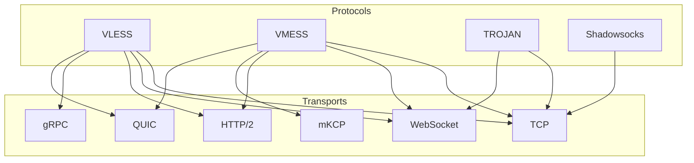

# 05 — نظرة على عائلة بروتوكولات V2Ray

يعرّف V2Ray (مشروع V) **بروتوكولات داخلية/خارجية** (كيف يثبت العميل هويته وأين
يريد الذهاب) فوق **طبقات نقل** (كيف تتحرك البايتات: TCP وWebSocket وH2 وgRPC
وmKCP وQUIC). وينفذ proxy-suite تركيبتين: **VLESS+WS** و**Trojan+WS**.

## مقارنة

| البروتوكول | الهوية | التشفير | UDP | تعدد الإرسال | مقاومة البصمة | الحالة هنا |
|------------|--------|----------|-----|--------------|----------------|------------|
| [VLESS](./06-vless.md) | ‏UUID (خفيف) | لا يوجد (اعتماد على TLS) | في المواصفة نعم، **مرفوض هنا** | عبر XTLS/Vision (ليس هنا) | جيدة مع TLS+WS+CDN | ✅ منفذ |
| [Trojan](./07-trojan.md) | كلمة مرور ← SHA224 | ‏TLS (يحاكي HTTPS) | لا | لا | ممتازة (يبدو HTTPS) | ✅ منفذ |
| [VMess](./08-vmess.md) | ‏UUID + تشفير ‏AEAD زمني | ‏AES-128-GCM / ChaCha20 | نعم | نعم (mKCP وغيره) | جيدة، أثقل | 📖 مرجعي فقط |
| [Shadowsocks](./09-shadowsocks.md) | مفتاح مشترك مسبقًا | شفرات AEAD | نعم (ترحيل UDP) | لا | متوسطة | 📖 مرجعي فقط |
| ‏SOCKS5 / HTTP | مستخدم/مرور (اختياري) | لا يوجد | ‏SOCKS نعم | لا | ضعيفة (نص عادي) | خارج النطاق |
| ‏Dokodemo-door | لا يوجد (شفاف) | لا يوجد | نعم | لا ينطبق | لا ينطبق (مساعد داخلي) | خارج النطاق |
| ‏Freedom / Blackhole | لا ينطبق (صادر) | لا ينطبق | — | — | — | خارج النطاق |

## كيف تختار

- **VLESS+WS+TLS+CDN:** الأرخص للتوسع خلف CDN مع عبء تشفير أدنى.
  اختره عندما تتحكم في الحافة وتريد عملاء كثيرين لكل نطاق.
- **Trojan+TLS:** الأصعب في البصمة السلبية (‏TLS صالح + مظهر HTTPS).
  اختره عندما تكون السرية أهم من الإنتاجية الخام.
- **VMess:** قديم؛ أبقه للعملاء القدامى وفضّل VLESS للمنشورات الجديدة.
- **Shadowsocks:** الأبسط للاستخدام الشخصي أحادي القفزة؛ أضعف أمام الفحص النشط.

## طبقات النقل

انظر [10-النقل](./10-transports.md). يثبّت هذا المشروع `type=ws` و`security=none`
داخليًا؛ واضبط `security=tls` لدى **العميل** عندما يضيف البروكسي العكسي TLS.

