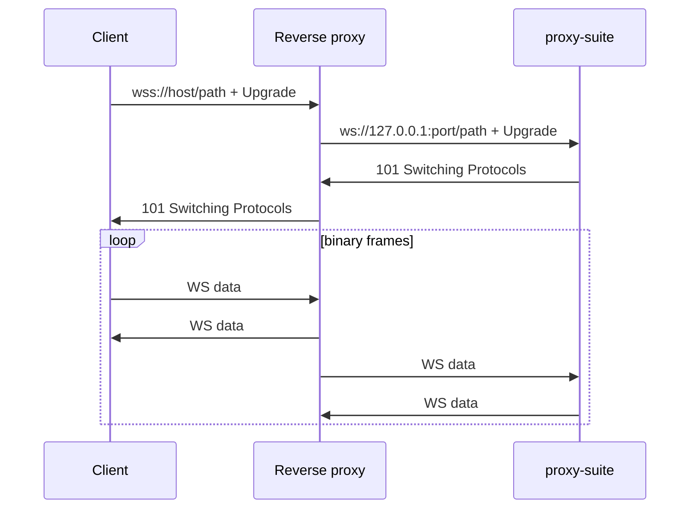

# 10 — طبقات النقل

تركب البروتوكولات (VLESS/Trojan/VMess) فوق **طبقات النقل**. وينفذ هذا المشروع
واحدة: **WebSocket** العادي. ويضيف العملاء TLS عند الحافة.

## ‏WebSocket (منفذة)

- العميل: `GET <websocket.path> HTTP/1.1` + ‏`Upgrade: websocket`.
- الخادم: مطابقة تامة للمسار ← `wss.handleUpgrade`؛ وإلا **تدمير المقبس**
  (بدون رد HTTP — انظر `rawUpgradeHead` في `tests/helpers.ts`).
- الإطارات: أول إطار **ثنائي** = المصافحة؛ والإطارات النصية تُتجاهل.
- الحدود: `maxPayload ‏16 MB`؛ وسقف هيدر VLESS ‏`4096 B`.
- ‏`ws://` عادي داخل العملية؛ وأنهِ TLS في الطبقة العليا للحصول على `wss://`.



مثال Nginx:

```nginx
location /vless-ws {
    proxy_pass http://127.0.0.1:8080;
    proxy_http_version 1.1;
    proxy_set_header Upgrade $http_upgrade;
    proxy_set_header Connection "upgrade";
    proxy_set_header Host $host;
}
```

## طبقات V2Ray الأخرى (مرجعية)

| النقل | كيف يبدو | الأفضل لـ | ملاحظات |
|-------|-----------|-----------|----------|
| ‏TCP (خام) | بايتات البروتوكول عارية | القفزات الداخلية | يُبصم بسهولة على الإنترنت |
| ‏H2 | تدفقات HTTP/2 | بديل WS متعدد الإرسال | يحتاج ALPN ‏+ TLS |
| ‏gRPC | استدعاءات أحادية/متدفقة | صديق CDN وحديث | تأطير `GunService/Tun` |
| ‏mKCP | ‏UDP مع FEC | الروابط المتقطعة | ضجيج وسرية ضعيفة |
| ‏QUIC | ‏UDP ‏+ TLS 1.3 | زمن وصول منخفض | ‏UDP يُخنق غالبًا |

قيم `type=` لدى العميل: `tcp | ws | h2 | grpc | kcp | quic`. وهذا المشروع يصدر
`type=ws` فقط.
